# Fractal Gallery — 51 Forms

All forms rendered at 480×360 via headless pygame (`SDL_VIDEODRIVER=dummy`).
Navigate the live engine with `python fractal_explorer_v3.py`.

---

## A · ESCAPE-TIME (11 forms)

Complex-plane iteration: points colored by escape speed or orbit trapping.

| Preview | Form | Description |
|---------|------|-------------|
| 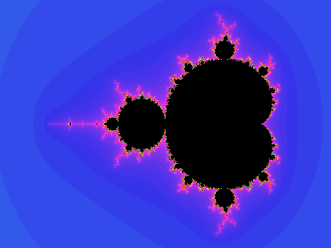 | **Mandelbrot** | The canonical escape-time set. Points c where z²+c stays bounded under iteration. Infinite boundary detail at every zoom level. |
| 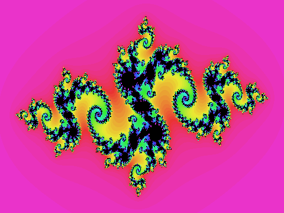 | **Julia 1** | Connected Julia set for a fixed c near the Mandelbrot boundary. Same iteration as Mandelbrot but c is fixed, z₀ varies. |
| 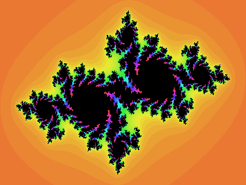 | **Julia 2** | Disconnected (Cantor dust) Julia set for c outside the Mandelbrot set. Demonstrates the dichotomy theorem. |
| 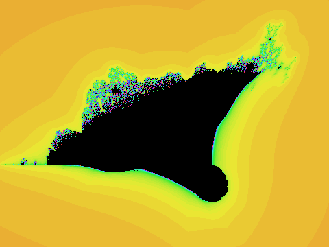 | **Burning Ship** | Uses \|Re(z)\| + i\|Im(z)\| before squaring. The absolute-value fold produces the characteristic ship silhouette. |
| 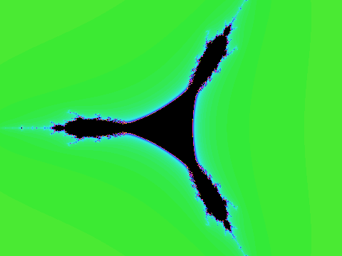 | **Tricorn** | Complex conjugate map z̄²+c (also called Mandelbar). Three-fold symmetry; not connected like the Mandelbrot set. |
| 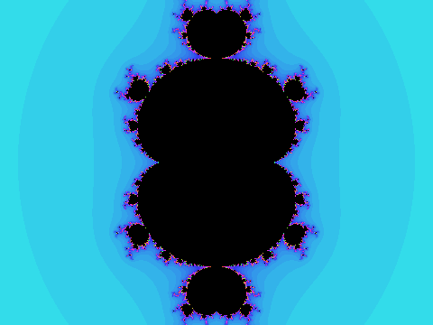 | **Multibrot³** | Mandelbrot with exponent 3: z³+c. Produces 2-fold symmetric forms with (d−1) primary bulbs. |
| 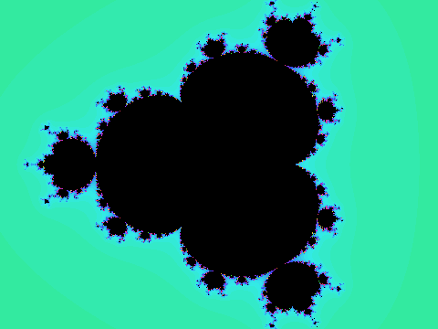 | **Multibrot⁴** | Exponent 4: z⁴+c. Each increment of d adds another primary bulb; the cardioid becomes a disk. |
| 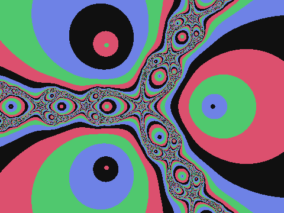 | **Newton** | Newton's root-finding method on z³−1=0. Basin boundaries form fractal curves between the three roots. |
| 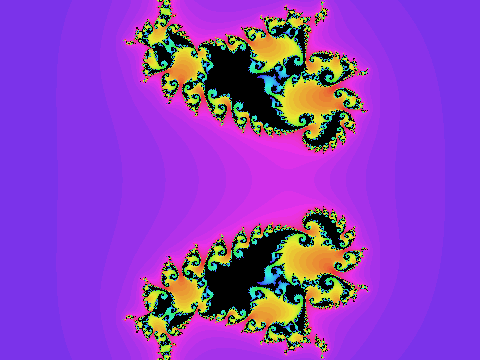 | **Phoenix** | Two-term recurrence: zₙ₊₁ = zₙ²+c + p·zₙ₋₁. The memory term p creates feather-like appendages. |
| 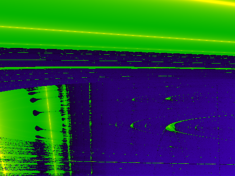 | **Lyapunov** | Lyapunov exponent plotted over (a,b) parameter space for sequences like AABAB. Stability boundaries produce banded color fields. |
| 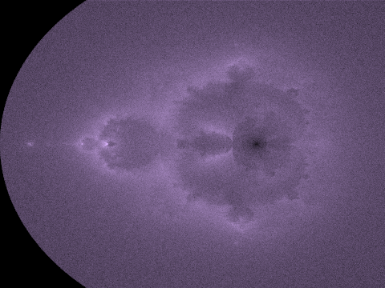 | **Buddhabrot** | Density plot of escape trajectories (not the set itself). Long-escaping orbits accumulate to form a meditating figure. |

---

## B · IFS (15 forms)

Iterated Function Systems: repeated application of affine contractions to a point cloud or geometric shape.

| Preview | Form | Description |
|---------|------|-------------|
| 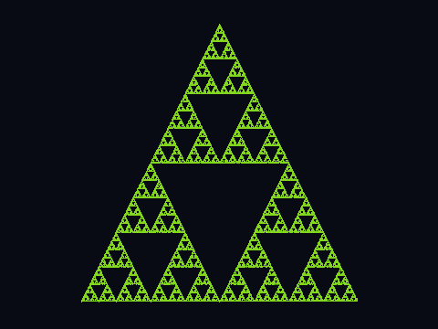 | **Sierpiński Triangle** | Three contractions each scaling by ½ toward a vertex. Hausdorff dimension log 3 / log 2 ≈ 1.585. |
| 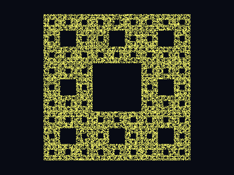 | **Sierpiński Carpet** | Eight contractions scaling by ⅓, excluding the centre square. Dimension log 8 / log 3 ≈ 1.893. |
| 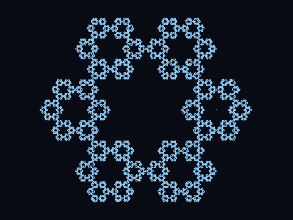 | **Sierpiński Hexagon** | Six contractions toward hexagon vertices. Produces a snowflake-like variant of the carpet. |
| 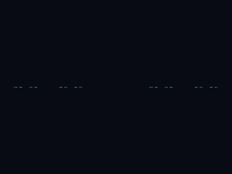 | **Cantor Set** | Two contractions scaling by ⅓ to left and right thirds. The first fractal set; dimension log 2 / log 3 ≈ 0.631. |
| 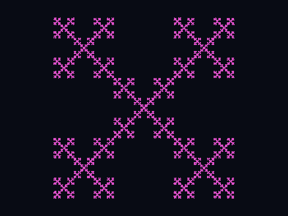 | **Vicsek** | Five contractions: four corners + centre, each ⅓ scale. Cross-shaped at each level of recursion. |
| 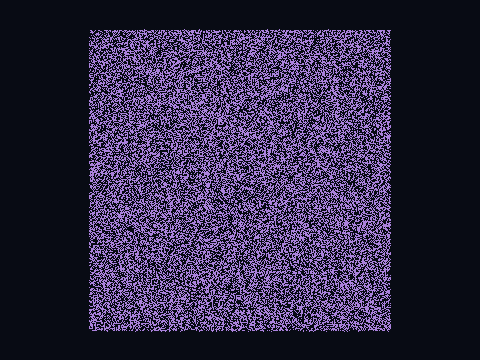 | **T-Square** | Self-similar subdivision of squares at corners. Dimension = 2; tiles the plane with zero-measure boundary. |
| 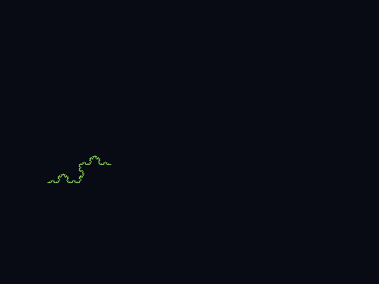 | **Koch Curve** | Single edge of the Koch snowflake. Four contractions each scaling by ⅓ with a 60° tent. Dimension log 4 / log 3 ≈ 1.262. |
| 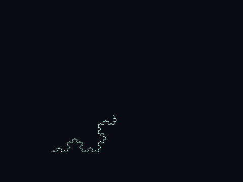 | **Koch Snowflake** | Three Koch curves on equilateral triangle edges. Finite area, infinite perimeter. |
| 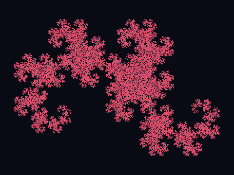 | **Heighway Dragon** | Two contractions with a rotation. Tiles the plane without overlap; self-similar at 90° turns. |
| 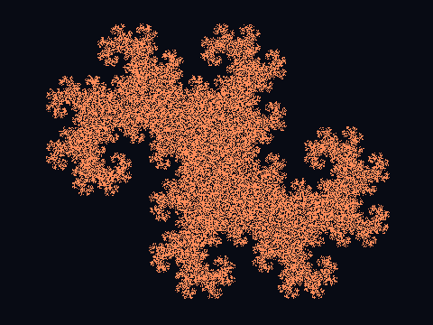 | **Twindragon** | Two Heighway dragons joined at the tail. Together they tile a rectangle. |
| 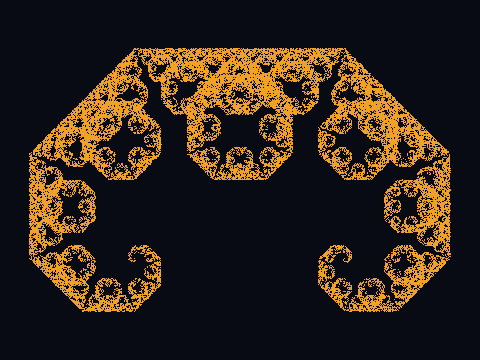 | **Lévy C Curve** | Two contractions each scaling by 1/√2 with ±45° rotations. Self-similar arc; dimension ≈ 1.934. |
| 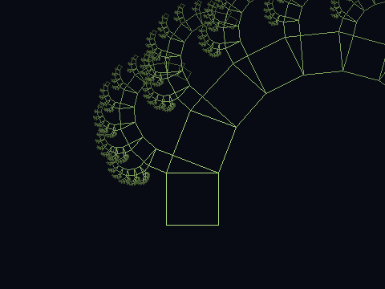 | **Pythagoras Tree** | Right-triangle IFS: each square sprouts two child squares satisfying a²+b²=c². Resembles organic branching. |
| 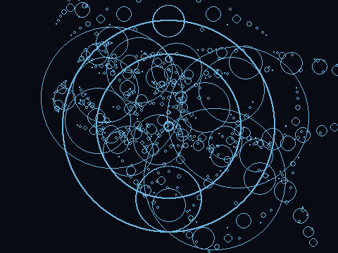 | **Apollonian Gasket** | Recursive circle packing: each gap filled by the unique tangent circle. Dimension ≈ 1.3057. |
| 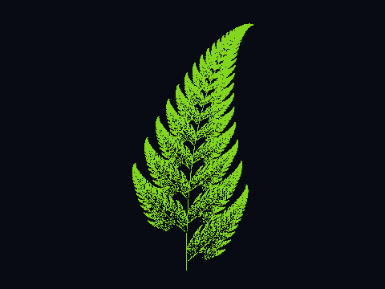 | **Barnsley Fern** | Four affine contractions with probability weights model a real fern frond. The first widely-known natural IFS. |
| 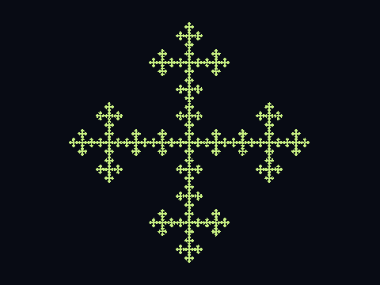 | **Plus Fractal** | Five contractions scaling by ⅓ arranged in a plus sign. Dimension log 5 / log 3 ≈ 1.465. |

---

## C · L-SYSTEM (8 forms)

Lindenmayer grammar rewrite + turtle graphics: strings expand under production rules and are drawn with forward/turn commands.

| Preview | Form | Description |
|---------|------|-------------|
| 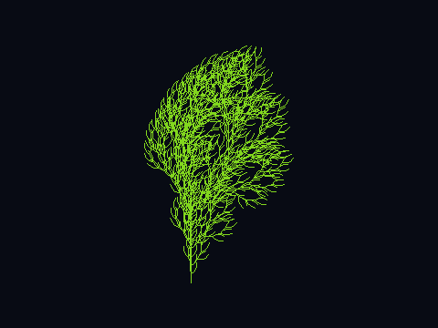 | **Binary Tree** | F → F[+F]F[−F]F. Each branch splits into two children; angle 25.7°. Resembles botanical branching. |
| 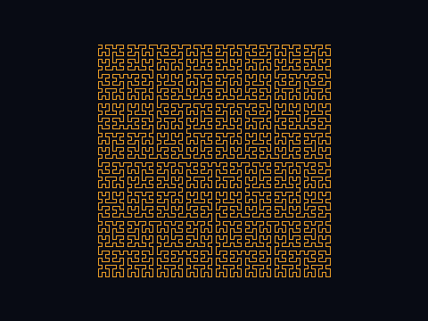 | **Hilbert Curve** | Space-filling curve visiting every cell of an n×n grid. Dimension 2. Preserves locality — nearby cells stay nearby. |
| 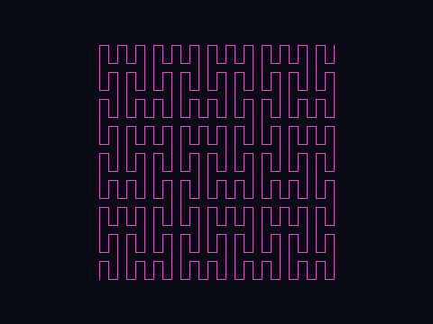 | **Peano Curve** | First space-filling curve (1890). 9-segment recursion filling a 3ⁿ×3ⁿ grid. Dimension 2. |
| 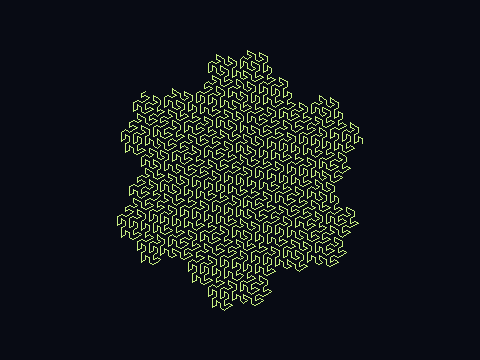 | **Gosper Curve** | Also called flowsnake. Replaces each segment with 7; tiles the plane with Gosper islands. Dimension log 7 / log √7 ≈ 2. |
| 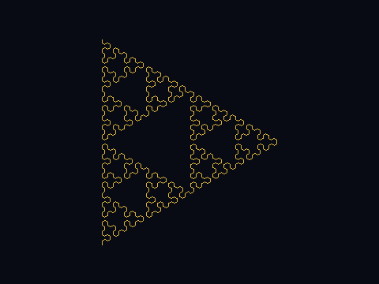 | **Sierpiński Arrowhead** | L-system encoding of the Sierpiński triangle. Produces the same fractal via a different generative mechanism. |
| 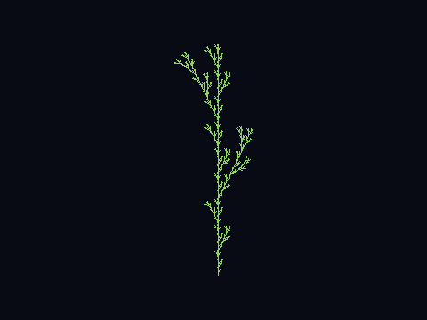 | **Plant 1** | Stochastic branching L-system: X → F+[[X]−X]−F[−FX]+X. Models herbaceous plant growth. |
| 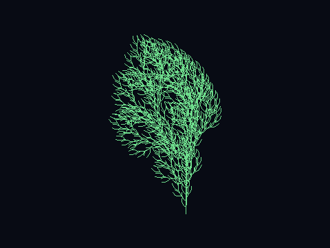 | **Plant 2** | Alternative branching grammar with tighter angles. Produces a denser, shrub-like silhouette. |
| 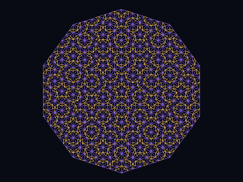 | **Penrose P3** | L-system encoding of the aperiodic P3 tiling (kites and darts). Fivefold symmetry; never repeats. |

---

## D · ATTRACTOR (7 forms)

Strange attractors from continuous ODEs (Lorenz, Rössler, Aizawa) and discrete maps (Clifford, De Jong, Ikeda, Hénon) — chaotic trajectories that stay bounded but never repeat.

| Preview | Form | Description |
|---------|------|-------------|
| 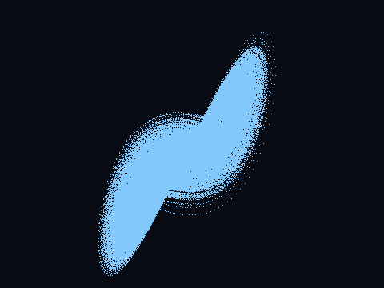 | **Lorenz** | The butterfly attractor (1963). Three ODEs modeling convection rolls. Dimension ≈ 2.06; the archetype of deterministic chaos. |
| 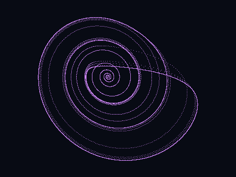 | **Rössler** | Simpler than Lorenz: one nonlinear term. Produces a folded-band attractor; dimension ≈ 2.01. |
| 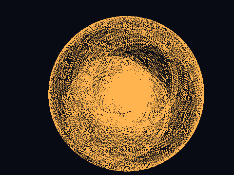 | **Aizawa** | Six-parameter 3D flow with a toroidal attractor winding around a fixed point. |
| 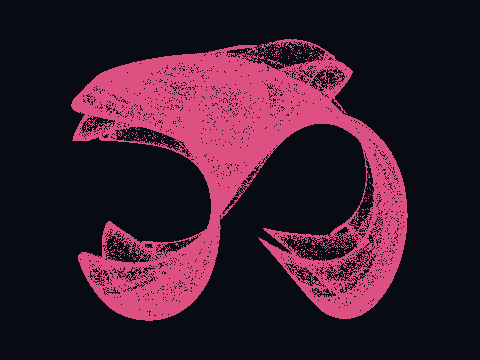 | **Clifford** | Discrete map: xₙ₊₁ = sin(a·yₙ)+c·cos(a·xₙ), yₙ₊₁ = sin(b·xₙ)+d·cos(b·yₙ). Parameters a–d produce wildly different patterns. |
| 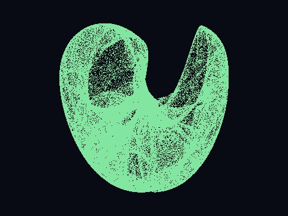 | **De Jong** | Similar structure to Clifford but with sin/cos swapped. Named after Peter de Jong; parameter-sensitive. |
| 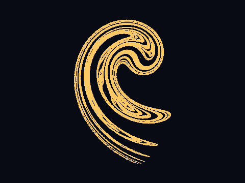 | **Ikeda** | Complex-plane map modeling light in an optical cavity. Originally derived for laser physics. |
| 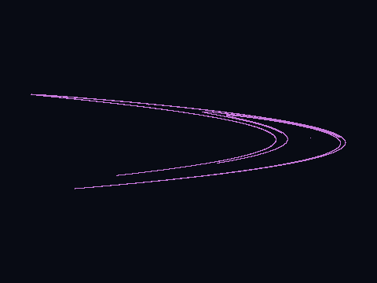 | **Hénon** | Two-parameter 2D map: xₙ₊₁ = 1−a·xₙ²+yₙ, yₙ₊₁ = b·xₙ. Canonical example of a dissipative chaotic map. Dimension ≈ 1.26. |

---

## E · SACRED (7 forms)

Sacred geometry: forms rooted in ancient geometric and numerological traditions, here rendered as mathematical constructions.

| Preview | Form | Description |
|---------|------|-------------|
| 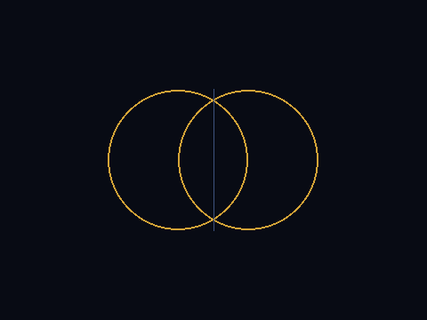 | **Vesica Piscis** | Intersection of two unit circles whose centres are one radius apart. Ratio of height to width = √3. Found in Gothic architecture and Euclidean constructions. |
| 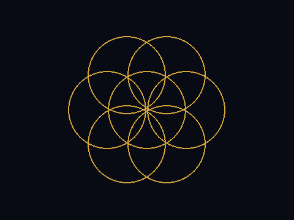 | **Seed of Life** | Seven circles: one central, six arranged at 60° intervals each passing through the centre. The generative kernel of the Flower of Life. |
| 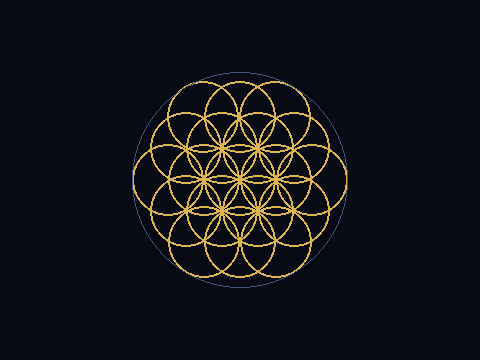 | **Flower of Life** | Concentric rings of interlocking circles at 60° spacing. Appears in the Temple of Osiris at Abydos (~700 BCE). |
| 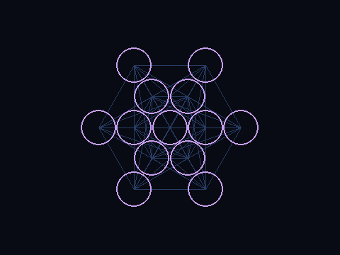 | **Metatron's Cube** | 13-circle Fruit of Life with lines connecting all centres. Contains projections of all five Platonic solids. |
| 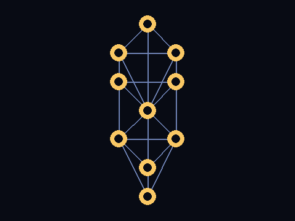 | **Tree of Life** | Kabbalistic diagram of 10 Sephirot connected by 22 paths. Nodes placed on three pillars with Da'at at centre. |
| 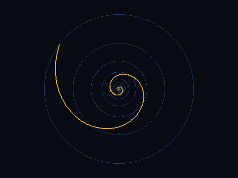 | **Golden Spiral** | Logarithmic spiral with growth factor φ per quarter turn. Approximated by successive Fibonacci rectangles. |
| 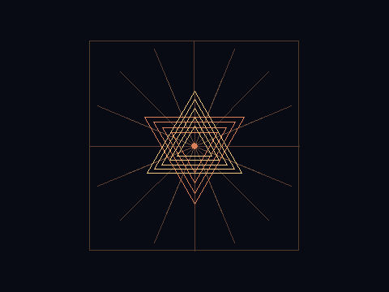 | **Sri Yantra** | Nine interlocking triangles (4 downward Shakti + 5 upward Shiva) producing 43 sub-triangles. Vedic geometric meditation object. |

---

## F · DIMENSION (3 forms)

3D raymarched fractals rendered onto a 2D surface via sphere-tracing distance estimators.

| Preview | Form | Description |
|---------|------|-------------|
| 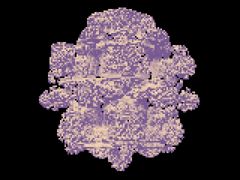 | **Mandelbulb** | 3D analogue of the Mandelbrot set using spherical coordinates: ρ→ρⁿ, θ→n·θ, φ→n·φ. Power 8 produces the canonical bulb. |
|  | **Mandelbox** | Box-fold + sphere-fold iterated map. Scale parameter s controls interior complexity; s=2 is the standard setting. |
| 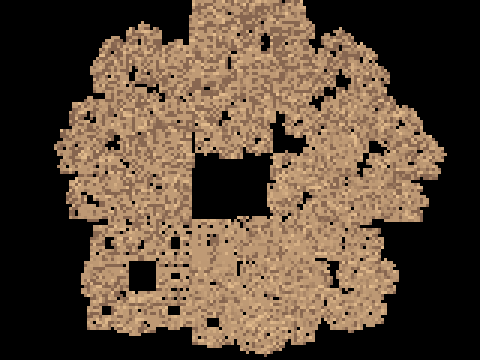 | **Menger Sponge** | 3D Cantor-set analogue: iteratively remove the centre and face-centre cubes from each 3×3×3 subdivision. Dimension log 20 / log 3 ≈ 2.727. |

---

## Stats

| Category | Forms | Dimension range |
|----------|-------|----------------|
| A · ESCAPE-TIME | 11 | 1.0–2.0 (boundary) |
| B · IFS | 15 | 0.63–2.0 |
| C · L-SYSTEM | 8 | 1.26–2.0 |
| D · ATTRACTOR | 7 | 1.26–2.06 |
| E · SACRED | 7 | — (geometric constructions) |
| F · DIMENSION | 3 | 2.73–3.0 |
| **Total** | **51** | |

## Running the engine

```bash
# Install deps (once)
pip install pygame numpy

# Launch interactive explorer
python fractal_explorer_v3.py

# Keys
# 1–6   jump to category A–F
# ← →   prev / next form within category
# Tab   next category
# R     reset current form
# F     toggle fullscreen
# Esc   quit
```

## Headless CLI render

Each form can be rendered to PNG without opening a window:

```bash
# List all form names (class names used by --render)
python fractal_explorer_v3.py --list

# Render at default size (480×360, 30 frames)
python fractal_explorer_v3.py --render Mandelbrot

# Render high-res
python fractal_explorer_v3.py --render BarnsleyFernIFS --frames 60 --size 1920x1080 --output barnsley.png

# Render all 51 forms to a directory (bash)
mkdir -p renders
while read name; do
    python fractal_explorer_v3.py --render "$name" --frames 30 --size 480x360 --output "renders/${name}.png"
done < <(python fractal_explorer_v3.py --list | grep -oP '^\s+\K\w+(?=\s)')
```

Use the class name (left column of `--list` output) for `--render`, not the display title.
Stochastic forms (Buddhabrot, Clifford, De Jong, Ikeda, Hénon) vary per run unless `--frames` is high enough to converge.
